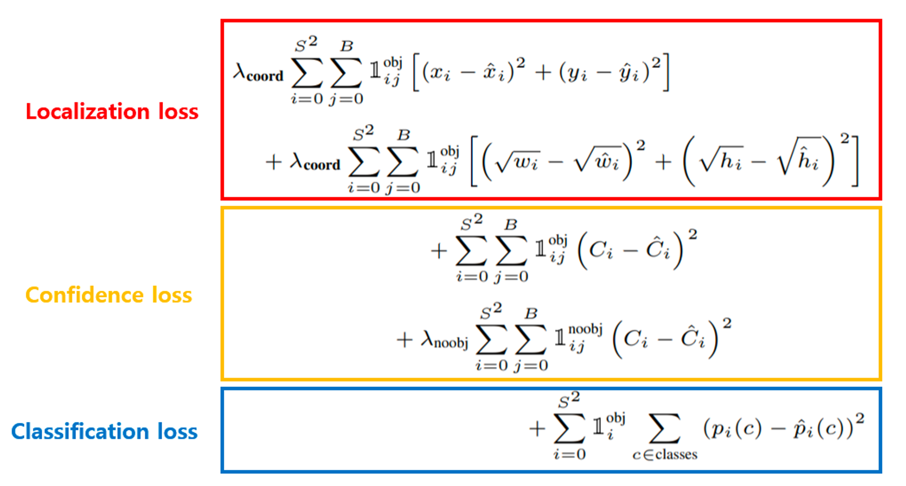

# Loss function

### **Localization loss**

- $λ_{coord}$: 영상 내에 객체가 없는 영역이 있는 영역보다 많이 존재할 수 있다. 이런 경우 Confidence score가 0으로 수렴되기 쉬워져 Gradient가 다른 Loss를 압도하여 학습에 악영향을 줄 수 있다. 저자는  해당 값을 5로 설정했다.
- $S^2$: grid cell의 수(=7x7=49)
- B: grid cell별 bounding box의 수(=2)
- $1^{obj}_{i,j}$: i번쨰 grid cell의 j번째 bbox가 객체를 예측하도록 할당(responsible for)받았을 때 1, 그렇지 않으면 0인 indicator function이다. grid cell에는 B개의 bbox를 예측하지만 그 중에서 가장 높은 confidence score를 갖는 하나의 bbox만을 학습한다.
- $x_i, y_i, w_i, h_i$: i 번째 label의 bbox의 중점 좌표인 x, y와 가로, 세로 크기인 width, height를 의미한다. 특히, bbox의 크기는 cell의 크기를 넘어갈 수 있기 때문에 상대적으로 큰 bbox의 loss가 크게 발생한다. 작은 bbox의 loss를 보정하기 위해 제곱근을 사용해서 표현한다.
- $\hat{x_i}, \hat{y_i}, \hat{w_i}, \hat{h_i}$: 모델의 prediction에 대한 bbox의 x, y 좌표, width, height를 나타낸다.

### **Confidence loss**

- $\lambda_{noobj}$: 객체를 포함하지 않는 grid cell에 대한 가중치를 의미한다. 저자는 0.5를 사용하였으며, 객체가 없는 경우에도 0.5보다 작아지지 않도록 하여 gradient가 크게 작용하는 것을 막는다. 또한 $λ_{coord}$ 보가 작게 설정되어 객체가 있는 경우에 대한 loss의 중요도를 높이는 역할도 수행한다.
- $1^{noobj}_{i, j}$: i 번째 grid cell의 j 번째 bbox가 객체를 예측하도록 할당(responsibel for) 받지 않았을 경우 1, 그렇지 않은 경우에는 0이 되는 indicator function이다.
- $C_i$: 객체가 포함되어 있는 경우 1, 그렇지 않은 경우 0이다.
- $\hat{C_i}$: 예측한 bbox의 confidence score를 의미한다.

### Classification loss

- $p_i(c)$: target label의 class probabilities이다.
- $\hat{p_i}(c)$: prediction의 class probabilities이다.